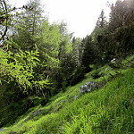
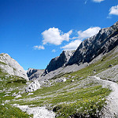
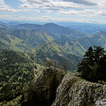
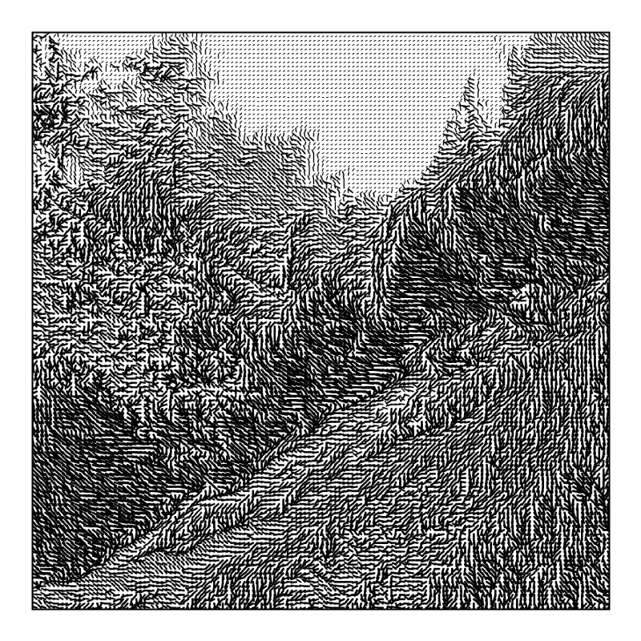
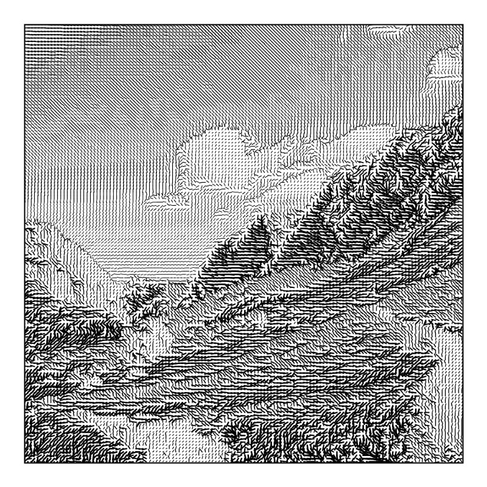
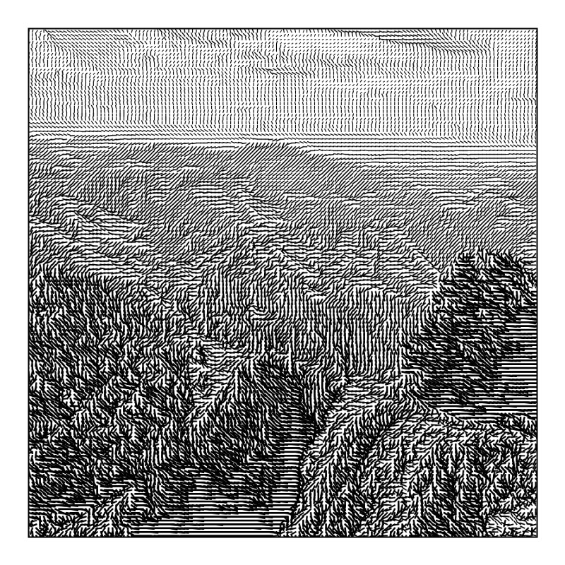

# grid-scapes
>This program renders series of abstract line graphics, based on three small resolution images. 

## Input images
As an input to this program I am taking three images of different landscapes that I took while hikinging the mountains. 

### Am Rupertisteig, Schöckl 

### Am Trawiessattel, Hochschwab 

### Rote Wand, Mixnitz 

## Rendered output

## Copyright
Feel free to use my program with your own images and edit the output as you need it. You also might look at my output stored . 
