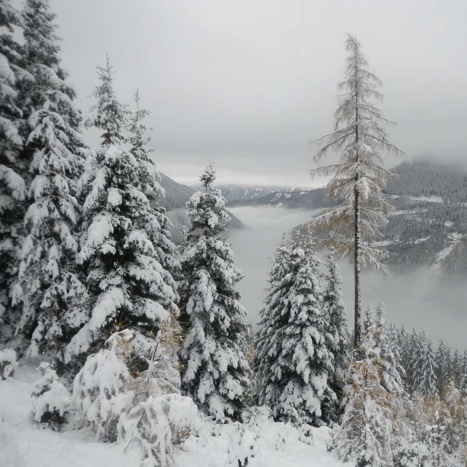
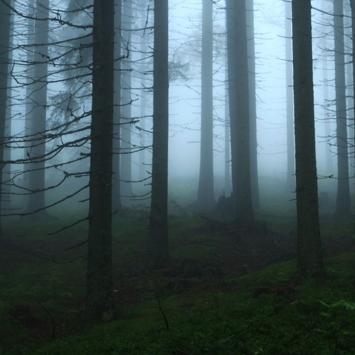
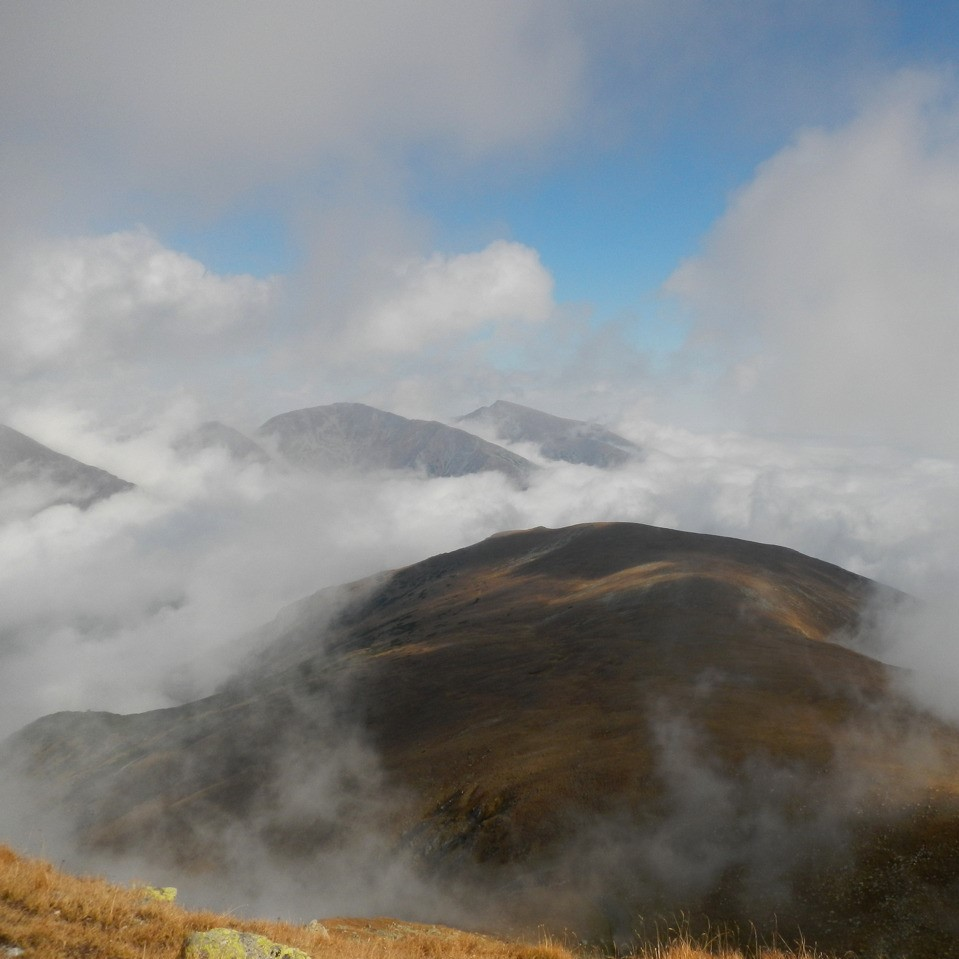
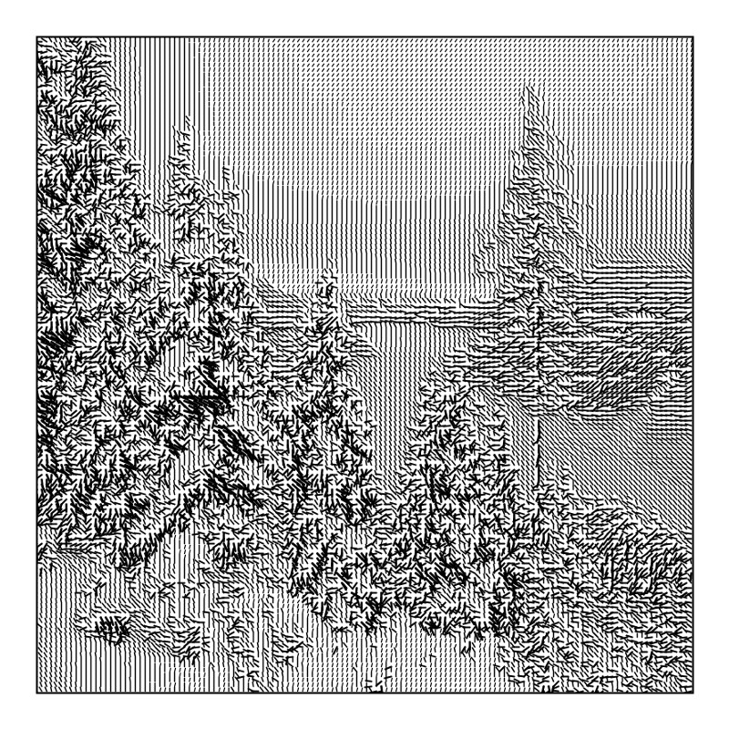
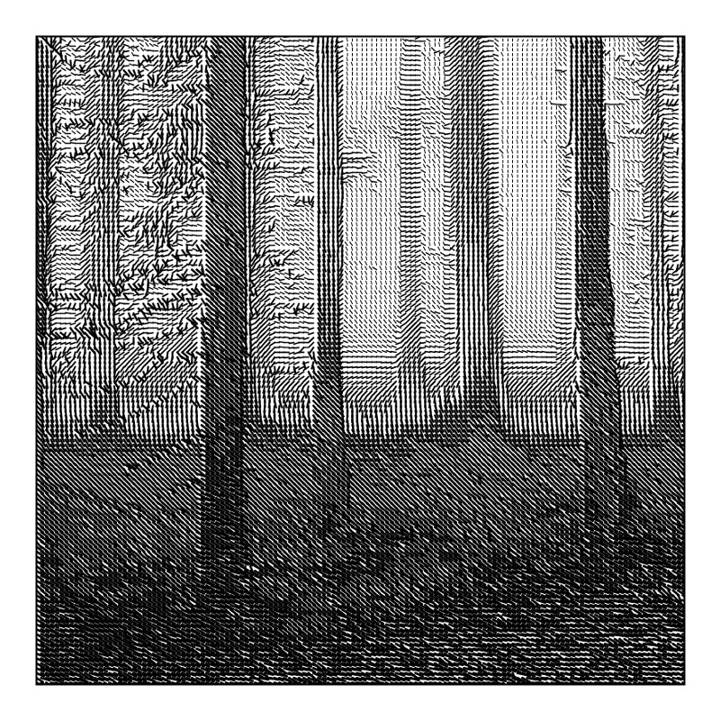
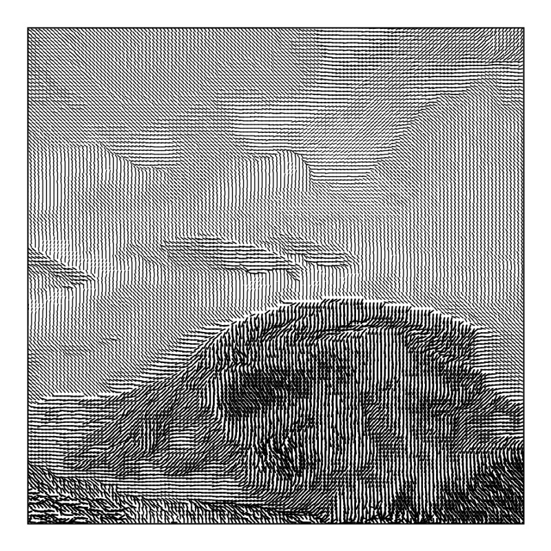

# grid-scapes
>This program renders series of abstract line graphics, based on images data. As an input to this program I am taking three images of different landscapes that I shot, while hikinging in the mountains. 

## Input images

## Rendered output
Rupertisteig, Schöckl 

Trawiessattel, Hochschwab 

Rote Wand, Mixnitz 

Hochreichart, Seckauer Tauern 

Grossofen, Pack Alpe

Ringkogel, Seckauer Tauern 

## Copyright
Feel free to use my program with your own images and edit the output as you need it. You also might look at my output stored in this repository.
